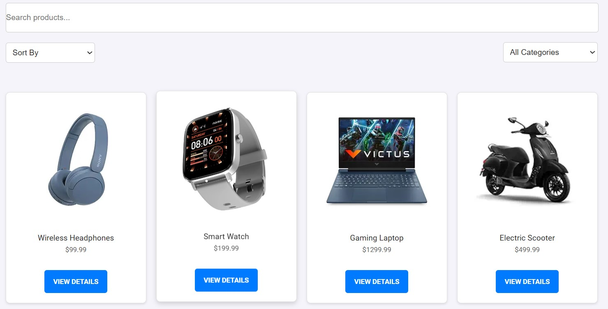
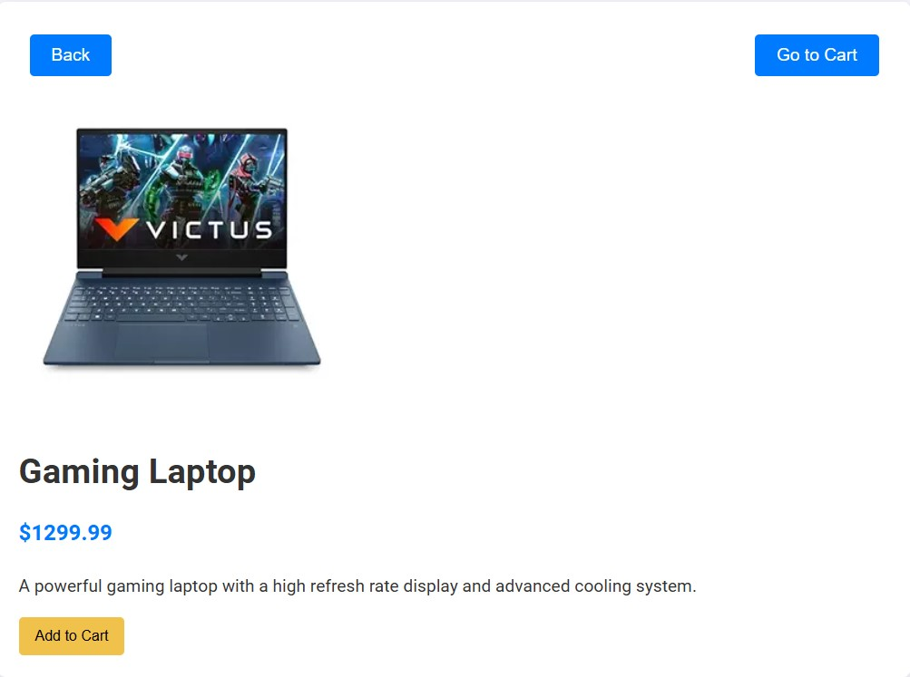
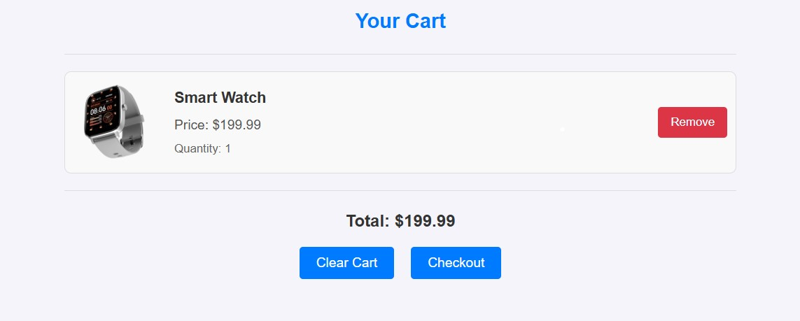

# Step 1: Navigate to your project directory
cd path/to/react-product-catalog

# Step 2: Create the README.md file
cat > README.md << EOL
# assignment_react-app_product_catalog

# Product Catalog React App

This is a simple React application to manage a product catalog. It uses React, React Router, and Axios for handling routing and API requests. The app is styled using modern web technologies and is designed to be responsive.

## Features

- Product listing with details view.
- React Router for navigating between pages.
- Responsive design optimized for various screen sizes.

## Technologies Used

- **React**: A JavaScript library for building user interfaces.
- **React Router DOM**: For handling routing in React applications.
- **ESLint**: For linting JavaScript code.

## Getting Started

### Prerequisites

Ensure you have **Node.js** and **npm** installed on your machine. You can check if you have them by running the following commands:

\`\`\`bash
node -v
npm -v
\`\`\`

## Installation

Clone the repository:
\`\`\`bash
git clone https://github.com/tropnicates/assignment_react-app_product_catalog.git
\`\`\`

Navigate into the project directory:
\`\`\`bash
cd assignment_react-app_product_catalog
\`\`\`

Install the dependencies:
\`\`\`bash
npm install
\`\`\`

## Running the Application

To start the development server, run:
\`\`\`bash
npm start
\`\`\`

This is the Live server:

https://assignment-react-app-product-catalog.vercel.app/

## These are some screenshots of the user interface:

### Home Page:

### View Details Page:

### Cart View Page:

EOL

# Step 3: Confirm the README.md file content
cat README.md

# Step 4: Ensure all images are in the correct directory
mkdir -p public/images
mv path/to/images/*.jpg public/images/

# Step 5: Run the React app and verify images
npm start
